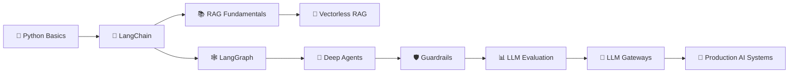

<div align="center">

<!-- Animated Banner -->
<p align="center">
  
</p>
<!-- Typing Animation -->
<a href="https://git.io/typing-svg">
  
</a>

<br/><br/>

<!-- Core Badges -->
[](https://python.org)
[](https://langchain.com)
[](https://langchain-ai.github.io/langgraph/)
[](https://openai.com)

<!-- Status Badges -->
[](LICENSE)
[]()
[](CONTRIBUTING.md)
[]()
[](https://www.youtube.com/watch?v=rV3HJ4LEZ7k)

</div>

---

## 📖 About This Repository

> 🌱 **A personal learning space for Generative AI & Agentic systems** — documenting my exploration of LangChain, LangGraph, RAG pipelines, Deep Agents, Guardrails, LLM Evaluation, and Gateway techniques.

This repo follows a structured 10+ hour curriculum, with hands-on notebooks, notes, and experiments as I work through each topic. It's a space to **learn by doing** — every module includes working code, reflections, and experiments.

---

## 🗂️ Module Index

| Module | Topic | Status |
|--------|-------|--------|
| 🔗 **LangChain** | Chains, Agents, Memory, Tools | 📘 Exploring |
| 🕸️ **LangGraph** | Stateful Agentic Workflows | 📘 Exploring |
| 📚 **RAG** | Retrieval-Augmented Generation | 📘 Exploring |
| 🚫 **Vectorless RAG** | PageIndex & Beyond Vectors | 📘 Exploring |
| 🤖 **Deep Agents** | Advanced Multi-Agent Systems | 📘 Exploring |
| 🛡️ **Guardrails** | LLM Safety & Output Control | 📘 Exploring |
| 📊 **LLM Evaluation** | RAG Eval, RAGAS, Metrics | 📘 Exploring |
| 🔀 **LLM Gateways** | Routing, Rate Limiting, Proxies | 📘 Exploring |

---


## 🚀 Modules at a Glance

<details>
<summary><b>🔗 Module 1 — LangChain</b> </summary>

**Topics I'm Learning:**
- LangChain Expression Language (LCEL)
- Chains, Agents, and Tool Use
- Memory & Conversation Management
- Prompt Templates & Output Parsers
- Document Loaders & Text Splitters
- Vector Stores & Retrievers

**Tech Stack:**


```bash
# Clone this repo and navigate to the module
git clone https://github.com/YOUR_USERNAME/genai-agentic-explorer
cd genai-agentic-explorer/langchain
pip install -r requirements.txt
```
</details>

<details>
<summary><b>🕸️ Module 2 — LangGraph</b> 
</summary>

**Topics I'm Learning:**
- Graph-based Agentic Architecture
- Stateful Workflows with Checkpointing
- Multi-Agent Collaboration Patterns
- Conditional Edges & Human-in-the-Loop
- Supervisor & Hierarchical Agents
- Tool Nodes & Custom State Schemas

**Tech Stack:**


```bash
cd genai-agentic-explorer/langgraph
pip install -r requirements.txt
```
</details>

<details>
<summary><b>📚 Module 3 — RAG (Retrieval-Augmented Generation)</b> 
</summary>

**Topics I'm Learning:**
- Naive RAG → Advanced RAG Pipeline
- Hybrid Search (Dense + Sparse)
- Re-ranking with Cross-Encoders
- Parent-Child Chunking Strategies
- Query Expansion & Routing
- Corrective RAG & Self-RAG

**Tech Stack:**


```bash
cd genai-agentic-explorer/rag
pip install -r requirements.txt
```
</details>

<details>
<summary><b>🚫 Module 4 — Vectorless RAG</b> (07:10:43)</summary>

**Topics I'm Learning:**
- PageIndex-based Document Retrieval
- BM25 & Keyword-Only Retrieval
- Structured Data Retrieval without Embeddings
- SQL Agents & Text-to-SQL
- Graph-based Knowledge Retrieval

**Why Vectorless?**
> Embeddings aren't always the answer. This module explores when and how to build RAG systems without vector databases — saving cost and latency while maintaining accuracy.
</details>

<details>
<summary><b>🤖 Module 5 — Deep Agents</b> (08:02:11)</summary>

**Topics I'm Learning:**
- ReAct, CoT, and ToT Agent Frameworks
- Tool-Calling & Function Agents
- Planning Agents (LLM Planner + Executor)
- Memory-Augmented Agents
- Multi-Modal Agent Architectures
- Production Deployment Patterns

**My Notes:**
> Deep Agents push LLMs from single-shot responders to multi-step, tool-using reasoners. This is where things get really interesting.
</details>

<details>
<summary><b>🛡️ Module 6 — Guardrails</b> (08:45:43)</summary>

**Topics I'm Learning:**
- Input & Output Validation with NeMo Guardrails
- Prompt Injection Defense
- Toxicity & PII Detection
- Constitutional AI Principles
- LangChain Guardrails Integration
- Custom Guardrail Rule Engines

**Tech Stack:**


</details>

<details>
<summary><b>📊 Module 7 — LLM Evaluation</b> (09:22:55)</summary>

**Topics I'm Learning:**
- RAGAS Framework (Faithfulness, Relevancy, Context Recall)
- LangSmith Tracing & Evaluation
- Automated LLM Judges
- Human Evaluation Pipelines
- A/B Testing LLM Outputs
- Benchmark Construction

**Tech Stack:**


</details>

<details>
<summary><b>🔀 Module 8 — LLM Gateways</b> (10:30:25)</summary>

**Topics I'm Learning:**
- LiteLLM Gateway Setup & Configuration
- Provider Routing (OpenAI, Anthropic, Groq, Cohere)
- Rate Limiting, Retries & Fallbacks
- Cost Tracking & Budget Management
- Load Balancing Across Model Providers
- API Key Management & Security

**Tech Stack:**


</details>

---

## 🛠️ Tech Stack Overview

<div align="center">

| Layer | Technologies |
|-------|-------------|
| **LLM Providers** |    |
| **Frameworks** |    |
| **Vector DBs** |    |
| **Evaluation** |   |
| **DevOps** |   |
| **Notebooks** |   |

</div>

---

## ⚙️ Getting Started

### Prerequisites

```bash
Python >= 3.10
pip or conda
Git
```

### Installation

```bash
# 1. Clone this repo
git clone https://github.com/saifullah857/GenAI-Agentic-Mastery.git
cd Langchainupdated

# 2. Create a virtual environment
python -m venv venv
source venv/bin/activate        # macOS/Linux
venv\Scripts\activate           # Windows

# 3. Install dependencies
pip install -r requirements.txt

# 4. Set up environment variables
cp .env.example .env
# Edit .env and add your API keys:
# OPENAI_API_KEY=sk-...
# ANTHROPIC_API_KEY=sk-ant-...
# GROQ_API_KEY=gsk_...
# LANGCHAIN_API_KEY=ls_...
```

### Running Notebooks

```bash
jupyter notebook
# or
jupyter lab
```

---

## 📁 Project Structure

```
📦 genai-agentic-explorer/
├── 🔗 langchain/
│   ├── chains/
│   ├── agents/
│   ├── memory/
│   └── tools/
├── 🕸️  langgraph/
│   ├── simple_agents/
│   ├── multi_agent/
│   └── supervisor/
├── 📚 rag/
│   ├── naive_rag/
│   ├── advanced_rag/
│   └── vectorless_rag/
├── 🤖 deep_agents/
│   ├── react_agents/
│   └── planning_agents/
├── 🛡️  guardrails/
├── 📊 llm_evaluation/
├── 🔀 llm_gateways/
├── notes/                  ← personal learning notes
├── .env.example
├── requirements.txt
└── README.md
```

---

## 🗺️ My Learning Roadmap



---

## 🤝 Contributing

Ideas, improvements, and discussions are always welcome!

```bash
# Fork → Clone → Branch → Commit → Push → Pull Request
git checkout -b feature/your-idea
git commit -m "feat: Add your idea"
git push origin feature/your-idea
```

---

## 📜 License

This project is licensed under the **MIT License** — see the [LICENSE](LICENSE) file for details.

---

## 🙌 Acknowledgements

- [LangChain](https://langchain.com) — The foundational agentic framework
- [LangGraph](https://langchain-ai.github.io/langgraph/) — Stateful agent orchestration
- [RAGAS](https://docs.ragas.io/) — RAG evaluation framework
- [LiteLLM](https://litellm.ai/) — Unified LLM gateway
- [NeMo Guardrails](https://github.com/NVIDIA/NeMo-Guardrails) — LLM safety toolkit

---

<div align="center">

[](https://www.youtube.com/watch?v=rV3HJ4LEZ7k)

<br/>

*Learning one module at a time — feel free to follow along!* 🌱

**⭐ Star this repo if it helps your learning journey too!**


</div>