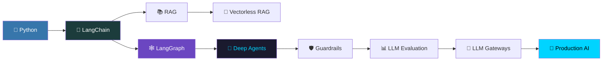

<div align="center">


<br/>


<br/><br/>

<a href="https://python.org"></a>
<a href="https://langchain.com"></a>
<a href="https://langchain-ai.github.io/langgraph/"></a>
<a href="https://openai.com"></a>

<br/><br/>


<a href="https://www.youtube.com/watch?v=rV3HJ4LEZ7k"></a>

</div>

---


## 🌌 About This Repository

> **A personal deep-dive into Generative AI & Agentic systems** — hands-on notebooks, annotated experiments, and structured notes covering the full GenAI engineering stack.

This repo follows a **10+ hour structured curriculum** — every module includes working code, personal reflections, and experiments. The philosophy: **learn by building**, not just watching.

```
📖 Learning Path: LangChain → RAG → LangGraph → Deep Agents → Guardrails → Evaluation → Gateways
```

---

## 🗂️ Module Index

<div align="center">

| # | Module | Focus Areas | Status |
|:-:|:-------|:------------|:------:|
| 01 | 🔗 **LangChain** | Chains, Agents, Memory, Tools, LCEL | `📘 Exploring` |
| 02 | 🕸️ **LangGraph** | Stateful Agentic Workflows, Multi-Agent | `📘 Exploring` |
| 03 | 📚 **RAG** | Naive → Advanced → Corrective RAG | `📘 Exploring` |
| 04 | 🚫 **Vectorless RAG** | BM25, SQL Agents, Graph Retrieval | `📘 Exploring` |
| 05 | 🤖 **Deep Agents** | ReAct, CoT, Planning, Memory Agents | `📘 Exploring` |
| 06 | 🛡️ **Guardrails** | Safety, PII Detection, Prompt Injection | `📘 Exploring` |
| 07 | 📊 **LLM Evaluation** | RAGAS, LangSmith, Automated Judges | `📘 Exploring` |
| 08 | 🔀 **LLM Gateways** | LiteLLM, Routing, Rate Limits, Cost | `📘 Exploring` |

</div>

---


## 🚀 Module Deep Dives

<details>
<summary><b>🔗 Module 01 — LangChain &nbsp;&nbsp;<code>Chains · Agents · Memory · Tools</code></b></summary>

<br/>

**What I'm learning:**

| Topic | Description |
|:------|:------------|
| **LCEL** | LangChain Expression Language — composing chains declaratively |
| **Agents & Tools** | Building tool-calling agents with custom & built-in tools |
| **Memory** | Conversation buffer, summary memory, entity memory |
| **Prompt Templates** | FewShot, ChatPromptTemplate, output parsers |
| **Document Loaders** | PDF, web, CSV loaders & text splitters |
| **Vector Stores** | FAISS & ChromaDB — embed, store, retrieve |

**Tech Stack:**


```bash
cd langchain && pip install -r requirements.txt
```

</details>

---

<details>
<summary><b>🕸️ Module 02 — LangGraph &nbsp;&nbsp;<code>Stateful · Multi-Agent · Supervisors</code></b></summary>

<br/>

**What I'm learning:**

| Topic | Description |
|:------|:------------|
| **Graph Architecture** | Nodes, edges, state schemas |
| **Checkpointing** | Stateful workflows with persistent memory |
| **Multi-Agent** | Collaboration patterns between specialized agents |
| **Conditional Edges** | Dynamic routing based on agent decisions |
| **Supervisor Pattern** | Hierarchical agent orchestration |
| **Human-in-the-Loop** | Approval gates and human feedback |

**Tech Stack:**


```bash
cd langgraph && pip install -r requirements.txt
```

</details>

---

<details>
<summary><b>📚 Module 03 — RAG &nbsp;&nbsp;<code>Naive → Advanced → Self-RAG</code></b></summary>

<br/>

**What I'm learning:**

| Topic | Description |
|:------|:------------|
| **Naive RAG** | Baseline: load → chunk → embed → retrieve → generate |
| **Hybrid Search** | Dense (embeddings) + Sparse (BM25) fusion |
| **Re-ranking** | Cross-encoder reranking for precision |
| **Advanced Chunking** | Parent-child, semantic, sliding window strategies |
| **Query Expansion** | HyDE, step-back prompting, multi-query |
| **Corrective / Self-RAG** | Retrieval grading, fallback, self-reflection |

**Tech Stack:**


```bash
cd rag && pip install -r requirements.txt
```

</details>

---

<details>
<summary><b>🚫 Module 04 — Vectorless RAG &nbsp;&nbsp;<code>Beyond Embeddings</code></b></summary>

<br/>

**Why Vectorless?**

> Embeddings aren't always the answer. This module explores when and how to build retrieval systems without vector databases — saving cost and latency while maintaining accuracy.

**What I'm learning:**

- **PageIndex-based** document retrieval
- **BM25 & TF-IDF** — keyword-only retrieval pipelines
- **Structured Data Retrieval** — querying without embeddings
- **SQL Agents & Text-to-SQL** — natural language over relational data
- **Knowledge Graph Retrieval** — graph-based context fetching

</details>

---

<details>
<summary><b>🤖 Module 05 — Deep Agents &nbsp;&nbsp;<code>ReAct · Planning · Multi-Modal</code></b></summary>

<br/>

**What I'm learning:**

| Framework | Description |
|:----------|:------------|
| **ReAct** | Reason + Act loops — the backbone of most agents |
| **CoT / ToT** | Chain-of-Thought & Tree-of-Thought reasoning |
| **Planning Agents** | LLM Planner + Executor separation |
| **Memory-Augmented** | Long-term episodic + semantic agent memory |
| **Multi-Modal** | Agents that reason over images & documents |
| **Production Patterns** | Error handling, retries, observability |

> *Deep Agents push LLMs from single-shot responders to multi-step, tool-using reasoners. This is where things get truly interesting.*

</details>

---

<details>
<summary><b>🛡️ Module 06 — Guardrails &nbsp;&nbsp;<code>Safety · PII · Injection Defense</code></b></summary>

<br/>

**What I'm learning:**

- **Input & Output Validation** with NeMo Guardrails
- **Prompt Injection Defense** — jailbreak detection & mitigation
- **Toxicity & PII Detection** — protecting users and data
- **Constitutional AI** — principle-guided output shaping
- **LangChain Integration** — guardrails as chain components
- **Custom Rule Engines** — domain-specific safety layers

**Tech Stack:**


</details>

---

<details>
<summary><b>📊 Module 07 — LLM Evaluation &nbsp;&nbsp;<code>RAGAS · LangSmith · Judges</code></b></summary>

<br/>

**What I'm learning:**

| Metric / Tool | Purpose |
|:-------------|:--------|
| **RAGAS** | Faithfulness, Answer Relevancy, Context Recall |
| **LangSmith** | Tracing, debugging, A/B evaluation |
| **DeepEval** | Unit-test style LLM evaluation |
| **LLM-as-Judge** | Automated GPT-4 evaluation pipelines |
| **Human Eval** | Structured human annotation frameworks |
| **Benchmark Design** | Building domain-specific eval sets |

**Tech Stack:**


</details>

---

<details>
<summary><b>🔀 Module 08 — LLM Gateways &nbsp;&nbsp;<code>LiteLLM · Routing · Cost Control</code></b></summary>

<br/>

**What I'm learning:**

| Feature | Description |
|:--------|:------------|
| **LiteLLM Setup** | Unified gateway for all major LLM providers |
| **Provider Routing** | OpenAI → Anthropic → Groq → Cohere fallbacks |
| **Rate Limiting** | Per-user, per-model quota management |
| **Cost Tracking** | Real-time budget monitoring and alerts |
| **Load Balancing** | Distribute load across model endpoints |
| **API Key Security** | Scoped keys and usage auditing |

**Tech Stack:**


```bash
cd llm_gateways && docker-compose up
```

</details>

---


## 🛠️ Full Tech Stack

<div align="center">

| Layer | Technologies |
|:------|:------------|
| **LLM Providers** |     |
| **Frameworks** |     |
| **Vector Stores** |    |
| **Evaluation** |    |
| **Safety** |  |
| **DevOps** |   |
| **Notebooks** |   |

</div>

---

## ⚙️ Quick Start

### Prerequisites
```bash
Python >= 3.10  |  pip  |  Git
```

### Setup
```bash
# 1. Clone
git clone https://github.com/saifullah857/GenAI-Agentic-Mastery.git
cd GenAI-Agentic-Mastery

# 2. Virtual environment
python -m venv venv
source venv/bin/activate          # macOS / Linux
venv\Scripts\activate             # Windows

# 3. Install dependencies
pip install -r requirements.txt

# 4. Configure API keys
cp .env.example .env
```

`.env` template:
```env
OPENAI_API_KEY=sk-...
ANTHROPIC_API_KEY=sk-ant-...
GROQ_API_KEY=gsk_...
LANGCHAIN_API_KEY=ls_...
TAVILY_API_KEY=tvly-...
```

### Run Notebooks
```bash
jupyter lab
```

---

## 📁 Project Structure

```
📦 GenAI-Agentic-Mastery/
│
├── 🔗 langchain/
│   ├── chains/            ← LCEL, sequential, parallel chains
│   ├── agents/            ← tool-calling & ReAct agents
│   ├── memory/            ← buffer, summary, entity memory
│   └── tools/             ← custom tools & toolkits
│
├── 🕸️  langgraph/
│   ├── simple_agents/     ← single-node graph agents
│   ├── multi_agent/       ← collaboration patterns
│   └── supervisor/        ← hierarchical orchestration
│
├── 📚 rag/
│   ├── naive_rag/         ← baseline pipeline
│   ├── advanced_rag/      ← hybrid search, reranking
│   └── vectorless_rag/    ← BM25, SQL agents, graphs
│
├── 🤖 deep_agents/
│   ├── react_agents/      ← ReAct, CoT, ToT
│   └── planning_agents/   ← planner + executor
│
├── 🛡️  guardrails/         ← NeMo integration, rule engines
├── 📊 llm_evaluation/     ← RAGAS, LangSmith, DeepEval
├── 🔀 llm_gateways/       ← LiteLLM, Docker setup
│
├── 📝 notes/              ← personal learning notes per module
├── .env.example
├── requirements.txt
└── README.md
```

---

## 🗺️ Learning Roadmap



---

## 🤝 Contributing

Discussions, corrections, and experiments are welcome!

```bash
git checkout -b feature/your-idea
git commit -m "feat: add your idea"
git push origin feature/your-idea
# → open a Pull Request
```

---

## 📜 License

**MIT License** — see [LICENSE](LICENSE) for details. Free to use, learn from, and build on.

---

## 🙌 Acknowledgements

| Resource | Description |
|:---------|:------------|
| [LangChain](https://langchain.com) | The foundational agentic AI framework |
| [LangGraph](https://langchain-ai.github.io/langgraph/) | Stateful graph-based agent orchestration |
| [RAGAS](https://docs.ragas.io/) | RAG evaluation metrics & framework |
| [LiteLLM](https://litellm.ai/) | Unified gateway for all LLM providers |
| [NeMo Guardrails](https://github.com/NVIDIA/NeMo-Guardrails) | NVIDIA's LLM safety toolkit |

---

<div align="center">

<a href="https://www.youtube.com/watch?v=rV3HJ4LEZ7k">
  
</a>

<br/><br/>

*Learning one module at a time — feel free to follow along!* 🌱

**⭐ Star this repo if it helps your learning journey!**


</div>